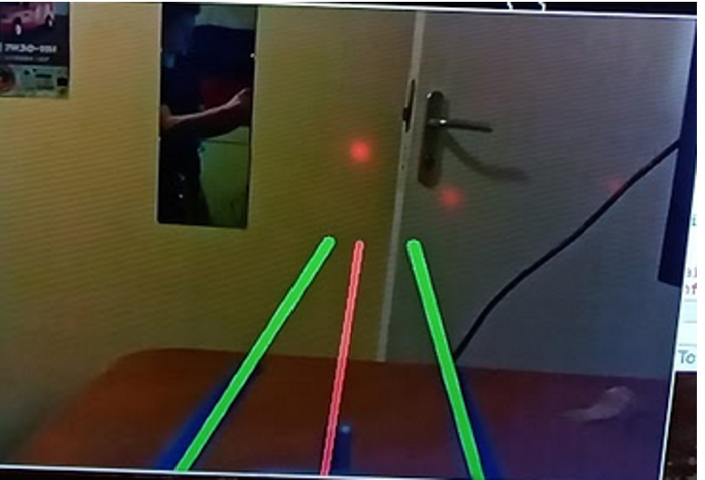
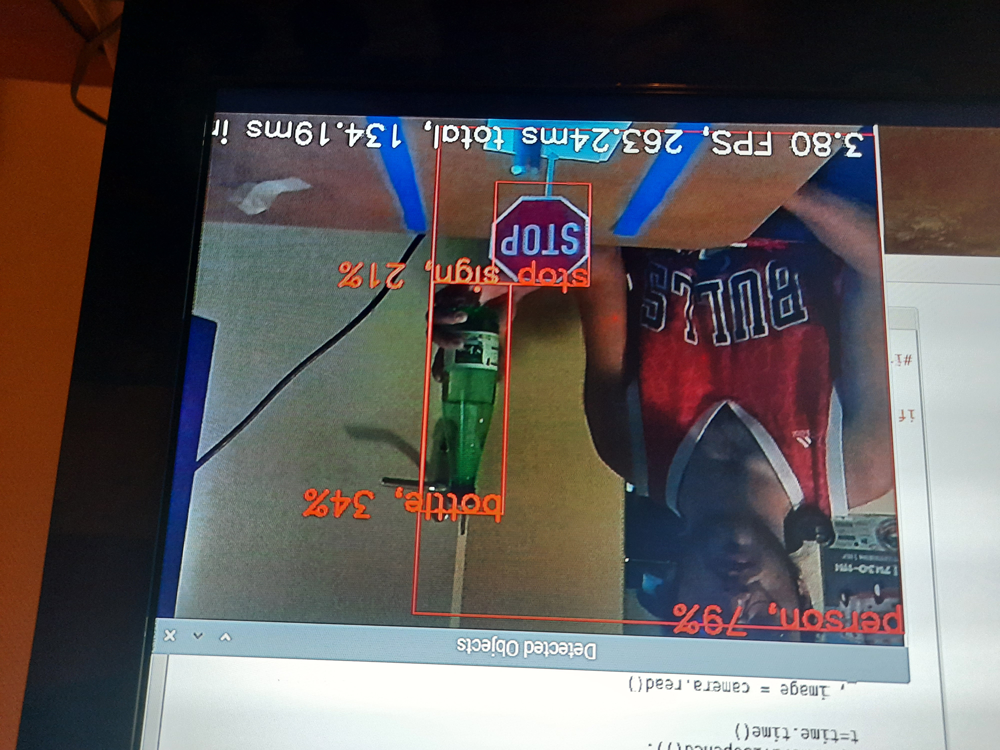
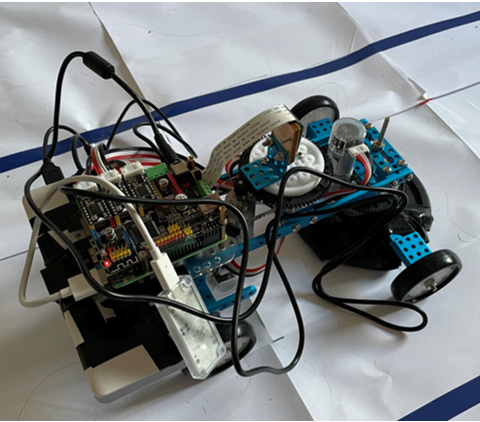

# Voiture Autonome
Projet de Voiture Autonome pour l'électif STA

# Contient:

1 - Une partie intelligence artificielle avec:
        - Un notebook pour l'entrainement d'un modele de transfer learning
        - Le modele entrainé (non fonctionnel) de détection d'obstacle ainsi que le script python pour la détection de panneaux de limitations de vitesse, stop, feu vert et rouge ainsi que des personne
        - Le modele MobilenetSSD entrainé sur le dataset COCO avec le script python pour la détection d'objet de la vie quotidienne
        
2 - Une partie reconnaissance de ligne qui contient le code python final exécuté.:
        - Ce script détecte les lignes et en déduit un angle de braquage, détecte des objets avec le modele "coco-MobileNetSSD" et commande la vitesse et l'angle en accord.
        
3 - Une partie communication qui n'est pas relié au reste du programme, mais qui permet d'établir une connection TCP entre la raspberry et un ordinateur central de commande.

4 - Une partie automatique, avec des fichiers MATLAB qui permettent de commander les MCC et les asservir en vitesse et en position.
        

